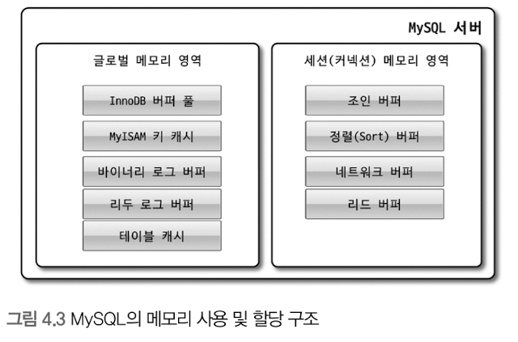
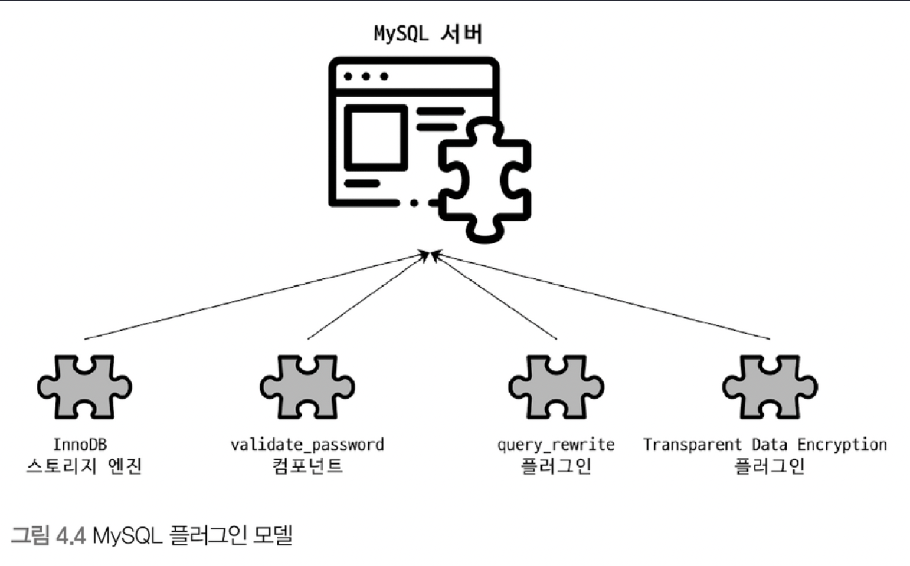
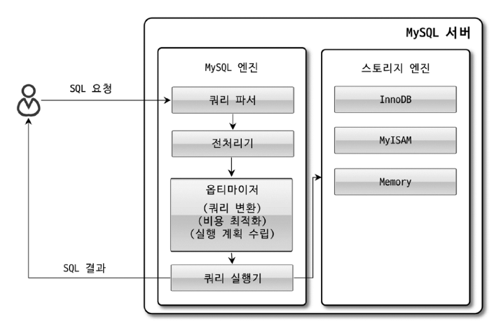

# 4.1 MySQL 엔진 아키텍처

## 4.1.1 MySQL의 전체 구조


MySQL 서버는 크게 **MySQL 엔진**과 **스토리지 엔진**으로 구분할 수 있다.

### 4.1.1.1 MySQL 엔진

MySQL 엔진은 클라이언트로부터의 접속 및 쿼리 요청을 처리하는 **커넥션 핸들러**, **SQL 파서 및 전처리기**, **옵티마이저**가 중심을 이룬다. 또한 MySQL은 **표준 SQL(ANSI SQL) 문법을 지원**하기 때문에 표준 문법에 따라 작성된 쿼리는 타 DBMS와 호환되어 실행될 수 있다.

### 4.1.1.2 스토리지 엔진

스토리지 엔진은 **실제 데이터를 디스크 스토리지에 저장하거나 디스크 스토리지로부터 데이터를 읽어오는 역할을 전담**한다. MySQL 서버에서 MySQL 엔진은 하나지만 **스토리지 엔진은 여러 개를 동시에 사용할 수 있다.** 다음과 같이 테이블이 사용할 스토리지 엔진을 지정하면 이후 해당 테이블의 모든 읽기, 쓰기 작업은 해당 스토리지 엔진에서 처리한다.

```mysql
//테이블 생성 시 스토리지 엔진 지정
mysql> CREATE TABLE test_table (col1 BIGINT, col2 BIGINT) ENGINE=INNODB;

//테이블 상태 확인
mysql> SHOW TABLE STATUS WHERE name = 'test_table';
```

### 4.1.1.3 핸들러 API

MySQL 엔진의 쿼리 실행기에서 테이블을 쓰거나 읽어야 할 때는 각 스토리지 엔진에 쓰기 또는 읽기를 요청하는데, 이러한 요청을 핸들러 요청이라고 하고, 여기서 사용되는 API를 핸들러 API라고 한다. InnoDB 스토리지 엔진 또한 이 핸들러 API를 이용해 MySQL 엔진과 데이터를 주고받는다. 이 핸들러 API를 통해 얼마나 많은 데이터(레코드) 작업이 있었는지 확인할 수도 있다.

```mysql
mysql> SHOW GLOBAL STATUS LIKE 'Handler%';
+----------------------------+-------+
| Variable_name              | Value |
+----------------------------+-------+
| Handler_commit             | 646   |
| Handler_delete             | 8     |
| Handler_discover           | 0     |
| Handler_external_lock      | 7213  |
| Handler_mrr_init           | 0     |
| Handler_prepare            | 8     |
| Handler_read_first         | 55    |
| Handler_read_key           | 2105  |
| Handler_read_last          | 0     |
| Handler_read_next          | 4448  |
| Handler_read_prev          | 0     |
| Handler_read_rnd           | 0     |
| Handler_read_rnd_next      | 17834 |
| Handler_rollback           | 0     |
| Handler_savepoint          | 0     |
| Handler_savepoint_rollback | 0     |
| Handler_update             | 343   |
| Handler_write              | 3344  |
+----------------------------+-------+
```

## 4.1.2 MySQL 스레딩 구조


**MySQL 서버는 프로세스 기반이 아닌, 스레드 기반으로 작동하며, 크게 포그라운드 스레드와 백그라운드 스레드로 구분할 수 있다.** MySQL 서버에서 실행 중인 스레드 목록은 `performance_schema` 데이터베이스의 `threads` 테이블에서 확인할 수 있다.

```mysql
mysql> SELECT thread_id, name, type, processlist_user, processlist_host FROM performance_schema.threads ORDER BY type, thread_id;
+-----------+---------------------------------------------+------------+------------------+------------------+
| thread_id | name                                        | type       | processlist_user | processlist_host |
+-----------+---------------------------------------------+------------+------------------+------------------+
|         1 | thread/sql/main                             | BACKGROUND | NULL             | NULL             |
|         3 | thread/innodb/io_ibuf_thread                | BACKGROUND | NULL             | NULL             |

    .....   

|        45 | thread/sql/one_connection                   | FOREGROUND | root             | localhost        |
|        46 | thread/sql/one_connection                   | FOREGROUND | root             | localhost        |
+-----------+---------------------------------------------+------------+------------------+------------------+
```

백그라운드 스레드의 개수는 MySQL 서버의 설정 내용에 따라 가변적일 수 있다. 동일한 이름의 스레드가 2개 이상씩 보이는 것은 MySQL 서버의 설정 내용에 의해 **여러 스레드가 동일 작업을 병렬로 처리하는 경우다.**

### 4.1.2.1 포그라운드 스레드(클라이언트 스레드)

포그라운드 스레드는 최소 MySQL 서버에 접속된 클라이언트의 수만큼 존재하며, 주로 각 클라이언트 사용자가 요청하는 쿼리 문장을 처리한다. 클라이언트 사용자가 작업을 마치고 커넥션을 종료하면 해당 커넥션을 담당했던 스레드는 다시 스레드 캐시로 되돌아간다. 이때 이미 스레드 캐시에 일정 개수 이상의 대기 중인 스레드가 있으면 스레드 캐시에 넣지 않고 스레드를 종료시킨다. 스레드 캐시에 유지할 수 있는 최대 스레드 개수는 `thread_cache_size` 시스템 변수로 설정한다.

### 4.1.2.2 백그라운드 스레드

MyISAM의 경우에는 별로 해당 사항이 없는 부분이지만   InnoDB는 다음과 같이 여러 가지 작업이 백그라운드로 처리된다.

- 인서트 버퍼(Insert Buffer)를 병합하는 스레드
- 로그를 디스크로 기록하는 스레드
- InnoDB 버퍼 풀의 데이터를 디스크에 기록하는 스레드
- 데이터를 버퍼로 읽어 오는 스레드
- 잠금이나 데드락을 모니터링하는 스레드

사용자의 요청을 처리하는 도중 데이터의 쓰기 작업은 지연(버퍼링)되어 처리될 수 있지만 **데이터의 읽기 작업은 절대 지연될 수 없다.** 그래서 일반적인 상용 DBMS에는 대부분 쓰기 작업을 일괄 처리하는 기능이 탑재돼 있으며, InnoDB 또한 이러한 방식으로 처리한다. 하지만 MyISAM은 그렇지 않고 사용자 스레드가 쓰기 작업까지 함께 처리하도록 설계돼 있다.

## 4.1.3 메모리 할당 및 사용 구조



MySQL에서 사용되는 메모리 공간은 크게 **글로벌 메모리 영역**과 **로컬 메모리 영역**으로 구분할 수 있다.

### 4.1.3.1 글로벌 메모리 영역

일반적으로 **클라이언트 스레드의 수와 무관**하게 하나의 메모리 공간만 할당되며, 필요에 따라 2개 이상의 메모리 공간을 할당받을 수도 있다. 생성된 글로벌 영역은 모든 스레드에 의해 공유된다.

### 4.1.3.2 로컬 메모리 영역(세션 메모리 영역)

MySQL 서버상에 존재하는 **클라이언트 스레드가 쿼리를 처리하는 데 사용하는 메모리 영역**이다.

로컬 메모리는 **각 클라이언트 스레드별로 독립적으로 할당**되며 절대 공유되어 사용되지 않는다는 특징이 있다.

로컬 메모리 공간의 또 한 가지 중요한 특징은 **각 쿼리의 용도별로 필요할 때만 공간이 할당**되고 필요하지 않은 경우에는 MySQL이 메모리 공간을 할당조차도 하지 않을 수도 있다는 점이다.

## 4.1.4 플러그인 스토리지 엔진 모델



MySQL의 독특한 구조 중 대표적인 것이 바로 플러그인 모델이다. MySQL 서버는 플러그인을 통해 스토리지 엔진, 검색어 파서 등 다양한 기능을 지원한다.

> MySQL 엔진이 각 스토리지 엔진으로부터 데이터를 읽어오거나 저장하도록 명령하려면 반드시 핸들러를 통해야 한다.

MySQL 서버에서 지원되는 스토리지 엔진과 플러그인을 확인해보자.

```mysql
//스토리지 엔진
mysql> SHOW ENGINES;
+--------------------+---------+----------------------------------------------------------------+--------------+------+------------+
| Engine             | Support | Comment                                                        | Transactions | XA   | Savepoints |
+--------------------+---------+----------------------------------------------------------------+--------------+------+------------+
| ndbcluster         | NO      | Clustered, fault-tolerant tables                               | NULL         | NULL | NULL       |
| FEDERATED          | NO      | Federated MySQL storage engine                                 | NULL         | NULL | NULL       |
| MEMORY             | YES     | Hash based, stored in memory, useful for temporary tables      | NO           | NO   | NO         |
| InnoDB             | DEFAULT | Supports transactions, row-level locking, and foreign keys     | YES          | YES  | YES        |
| PERFORMANCE_SCHEMA | YES     | Performance Schema                                             | NO           | NO   | NO         |
| MyISAM             | YES     | MyISAM storage engine                                          | NO           | NO   | NO         |
| ndbinfo            | NO      | MySQL Cluster system information storage engine                | NULL         | NULL | NULL       |
| MRG_MYISAM         | YES     | Collection of identical MyISAM tables                          | NO           | NO   | NO         |
| BLACKHOLE          | YES     | /dev/null storage engine (anything you write to it disappears) | NO           | NO   | NO         |
| CSV                | YES     | CSV storage engine                                             | NO           | NO   | NO         |
| ARCHIVE            | YES     | Archive storage engine                                         | NO           | NO   | NO         |
+--------------------+---------+----------------------------------------------------------------+--------------+------+------------+

//플러그인
mysql> SHOW PLUGINS;
+----------------------------------+----------+--------------------+---------+---------+
| Name                             | Status   | Type               | Library | License |
+----------------------------------+----------+--------------------+---------+---------+
| binlog                           | ACTIVE   | STORAGE ENGINE     | NULL    | GPL     |
| mysql_native_password            | ACTIVE   | AUTHENTICATION     | NULL    | GPL     |
              .....
| mysqlx_cache_cleaner             | ACTIVE   | AUDIT              | NULL    | GPL     |
| mysqlx                           | ACTIVE   | DAEMON             | NULL    | GPL     |
+----------------------------------+----------+--------------------+---------+---------+
```

## 4.1.5 컴포넌트

**MySQL 8.0 부터는 기존의 플러그인 아키텍처를 대체하기 위해 컴포넌트 아키텍처가 지원된다.**

기존 MySQL 서버의 플러그인 방식은 몇 가지 단점이 존재한다.

- 플러그인은 오직 MySQL 서버와 인터페이스할 수 있고, 플러그인끼리는 통신할 수 없다.
- 플러그인은 MySQL 서버의 변수나 함수를 직접 호출하기 때문에 안전하지 않다.(캡슐화가 안 됨)
- 플러그인은 상호 의존 관계를 설정할 수 없어서 초기화가 어렵다.

비밀번호 검증 기능 컴포넌트를 통해 컴포넌트의 간단한 사용법을 살펴보자.

```mysql
//validate_password 컴포넌트 설치
mysql> INSTALL COMPONENT 'file://component_validate_password';

//설치된 컴포넌트 확인
mysql> SELECT * FROM mysql.component;
+--------------+--------------------+------------------------------------+
| component_id | component_group_id | component_urn                      |
+--------------+--------------------+------------------------------------+
|            1 |                  1 | file://component_validate_password |
+--------------+--------------------+------------------------------------+
```

## 4.1.6 쿼리 실행 구조



### 4.1.6.1 쿼리 파서

쿼리 파서는 사용자 요청으로 들어온 쿼리 문장을 토큰(MySQL이 인식할 수 있는 최소 단위의 어휘나 기호)으로 분리해 트리 형태의 구조로 만들어 내는 작업을 의미한다. 쿼리 문장의 기본 문법 오류는 이 과정에서 발견된다.

### 4.1.6.2 전처리기

파서 과정에서 만들어진 파서 트리를 기반으로 쿼리 문장에 구조적인 문제점이 있는지 확인한다. 실제 존재하지 않거나 권한상 사용할 수 없는 개체의 토근은 이 단계에서 걸러진다.

### 4.1.6.3 옵티마이저

사용자의 요청으로 들어온 쿼리 문장을 저렴한 비용으로 가장 빠르게 처리할지를 결정하는 역할을 담당하며, DBMS의 두뇌에 해당한다.

### 4.1.6.4 실행 엔진

실행 엔진은 만들어진 계획대로 각 핸들러에게 요청해서 받은 결과를 또 다른 핸들러 요청의 입력으로 연결하는 역할을 수행한다.

### 4.1.6.5 핸들러(스토리지 엔진)

MySQL 서버의 가장 밑단에서 MySQL 실행 엔진의 요청에 따라 데이터를 디스크로 저장하고 디스크로부터 읽어 오는 역할을 담당한다.

## 4.1.7 복제

## 4.1.8 쿼리 캐시

MySQL 서버에서 쿼리 캐시는 빠른 응답을 필요로 하는 웹 기반의 응용 프로그램에서 매우 중요한 역할을 담당했다. 하지만 쿼리 캐시는 테이블의 데이터가 변경되면 캐시에 저장된 결과 중에서 변경된 테이블과 관련된 것들은 모두 삭제해야 했다. 이는 **심각한 동시 처리 성능 저하와 버그를 유발**하였다.

결국 **MySQL 8.0으로 올라오면서 쿼리 캐시는 MySQL 서버의 기능에서 완전히 제거되고, 관련된 시스템 변수도 모두 제거됐다.**

## 4.1.9 스레드 풀

MySQL 서버 엔터프라이즈 에디션은 스레드 풀 기능을 제공하지만 MySQL 커뮤니티 에디션은 스레드 풀 기능을 지원하지 않는다. 만약 커뮤니티 에디션에서도 스레드 풀 기능을 사용하고자 한다면 동일 버전의 `Percona Server`에서 스레드 풀 플러그인 라이브러리를 설치해서 사용하면 된다.

## 4.1.10 트랜잭션 지원 메타데이터

MySQL 5.7 버전까지 테이블의 구조를 FRM 파일에 저장하고 일부 스토어드 프로그램 또한 파일 기반으로 관리했다. 하지만 이러한 **파일 기반의 메타데이터는 트랜잭션을 지원하지 않기 때문에 테이블 생성 또는 변경 도중 MySQL 서버가 비정상적으로 종료되면 일관되지 않은 상태로 남는 문제가 있었다.**

MySQL 8.0 버전부터는 이러한 문제점을 해결하기 위해 **테이블의 구조 정보나 스토어드 프로그램의 코드 관련 정보를 모두 InnoDB의 테이블에 저장하도록 개선**됐다.

MySQL 서버에서 InnoDB 스토리지 엔진을 사용하는 테이블은 메타 정보가 InnoDB 테이블 기반의 딕셔너리에 저장되지만 MyISAM이나 CSV 등과 같은 스토리지 엔진의 메타 정보는 여전히 저장할 공간이 필요하다. MySQL 서버는 **InnoDB 스토리지 엔진 이외의 스토리지 엔진을 사용하는 테이블들을 위해 SDI(Serialized Dictionary Information) 파일을 사용한다.**
