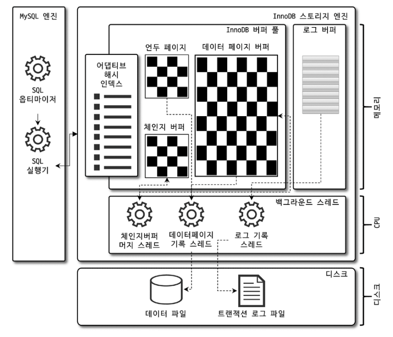

# 4.2 InnoDB 스토리지 엔진 아키텍처



InnoDB는 MySQL에서 사용할 수 있는 스토리지 엔진 중 **거의 유일하게 레코드 기반의 잠금을 제공**하며, 그 때문에 **높은 동시성 처리가 가능하고 안정적이며 성능이 뛰어나다.**

## 4.2.1 프라이머리 키에 의한 클러스터링

InnoDB의 모든 테이블은 기본적으로 **프라이머리 키를 기준으로 클러스터링되어 저장된다.** 프라이머리 키가 클러스터링 인덱스이기 때문에 프라이머리 키를 이용한 레인지 스캔은 상당히 빨리 처리될 수 있다. 결과적으로 쿼리의 **실행 계획에서 프라이머리 키는 기본적으로 다른 보조 인덱스에 비해 비중이 높게 설정된다.**

InnoDB 스토리지 엔진과는 달리 MyISAM 스토리지 엔진에서는 클러스터링 키를 지원하지 않는다. MyISAM 스토리지 엔진에서 **프라이머리 키는 유니크 제약을 가진 세컨더리 인덱스일 뿐이다.**

## 4.2.2 외래 키 지원

**외래 키에 대한 지원은 InnoDB 스토리지 엔진 레벨에서 지원하는 기능**으로 MyISAM이나 MEMORY 테이블에서는 사용할 수 없다. InnoDB에서 외래 키는 **부모 테이블과 자식 테이블 모두 해당 컬럼에 인덱스 생성이 필요하고, 변경 시에는 반드시 부모 테이블이나 자식 테이블에 데이터가 있는지 체크하는 작업이 필요하므로 잠금이 여러 테이블로 전파되고, 그로 인해 데드락이 발생할 때가 많으므로 개발할 때도 외래 키의 존재에 주의하는 것이 좋다.**

서비스 운영 중 외래 키 체크 작업을 일시적으로 멈추고 싶다면 `foreign_key_checks` 시스템 변수를 OFF로 설정하면 된다. 이렇게 되면 레코드 적재나 삭제 등의 작업도 부가적인 체크가 필요 없기 때문에 훨씬 빠르게 처리할 수 있다.

```mysql
//외래 키 체크 OFF
mysql> SET foreign_key_checks=OFF;

//외래 키 체크 ON
mysql> SET foreign_key_checks=ON;
```

외래 키 체크를 일시적으로 해제했다고 해서 **부모와 자식 테이블 간의 관계가 깨진 상태 그대로 유지해도 된다는 것을 의미하지는 않는다.** 

> `foreign_key_checks` 시스템 변수는 적용 범위를 GLOBAL, SESSION 모두로 설정 가능한 변수다. 그래서 이런 작업을 할 때는 다음과 같이 반드시 현재 작업을 실행하는 세션에서만 외래 키 체크 기능을 멈추게 해야 한다. SESSION 키워드를 명시하지 않으면 자동으로 현재 세션의 설정만 변경한다.
>
> ```mysql
> mysql> SET foreign_key_checks=OFF;
> mysql> SET SESSION foreign_key_checks=OFF;
> ```

## 4.2.3 MVCC(Multi Version Concurrency Control)

일반적으로 레코드 레벨의 트랜잭션을 지원하는 DBMS가 제공하는 기능이며, MVCC의 가장 큰 목적은 **잠금을 사용하지 않는 일관된 읽기를 제공하는 데 있다.** InnoDB는 `언두 로그(Undo Log)`를 이용해 이 기능을 구현한다. 여기서 멀티 버전이라 함은 **하나의 레코드에 대해 여러 개의 버전이 동시에 관리된다는 의미다.**

격리 수준이 `READ_COMMITTED`인 MySQL 서버에서 InnoDB 스토리지 엔진을 사용하는 테이블의 데이터 변경을 어떻게 처리하는지 알아보자.

우선 다음과 같은 테이블에 한 건의 레코드를 `INSERT`한 다음 `UPDATE`해서 발생하는 변경 작업 및 절차를 확인해 보자.

```mysql
mysql> CREATE TABLE member (
    m_id INT NOT NULL, 
    m_name VARCHAR(20) NOT NULL, 
    m_area VARCHAR(100) NOT NULL, 
    PRIMARY KEY (m_id), 
    INDEX ix_area (m_area)
  );
mysql> INSERT INTO member VALUES (12, '홍길동', '서울');
mysql> COMMIT;
```

INSERT 문이 실행되면 데이터베이스의 상태는 다음과 같은 상태로 바뀔 것이다.


그리고 UPDATE 문이 실행되면 데이터베이스의 상태는 다시 다음과 같은 상태로 바뀔 것이다.

```mysql
mysql> UPDATE member SET m_area='경기' WHERE m_id=12;
```


UPDATE 문이 실행되면 **커밋 실행 여부 관계없이** InnoDB의 버퍼 풀은 새로운 값인 '경기'로 업데이트된다. 그리고 디스크의 데이터 파일에는 체크포인트나 InnoDB의 Write 스레드에 의해 새로운 값으로 업데이트돼 있을 수도 있고 아닐 수도 있다(ACID를 보장하기 때문에 InnoDB의 버퍼 풀과 데이터 파일은 동일한 상태라고 가정해도 무방하다). 아직 COMMIT이나 ROLLBACK이 되지 않은 상태에서 다른 사용자가 다음 같은 쿼리로 레코드를 조회하면 어디에 있는 데이터를 조회할까?

```mysql
mysql> SELECT * FROM member WHERE m_id=12;
```

이 질문의 답은 **MySQL 서버의 격리 수준에 따라 다르다는 것이다.** `READ_UNCOMMITTED`인 경우에는 InnoDB 버퍼 풀이 현재 가지고 있는 변경된 데이터를 읽어서 반환한다. 그렇지 않고 `READ_COMMITTED`나 그 이상의 격리 수준인 경우에는 아직 커밋되지 않았기 때문에 변경되기 이전의 내용을 보관하고 있는 **언두 영역의 데이터를 반환한다.** 이러한 과정을 DBMS에서는 MVCC라고 한다.

**커밋이 되더라도 언두 영역의 데이터는 바로 삭제되지 않는다.** 해당 영역을 필요로하는 트랜잭션이 없을 때 비로소 삭제된다.

## 4.2.4 잠금 없는 일관된 읽기(Non-Locking Consistent Read)

InnoDB 스토리지 엔진은 **MVCC 기술을 이용해 잠금을 걸지 않고 읽기 작업을 수행한다.** 잠금을 걸지 않기 때문에 InnoDB에서 읽기 작업은 다른 트랜잭션이 가지고 있는 잠금을 기다리지 않고, 읽기 작업이 가능하다. **특정 사용자가 레코드를 변경하고 아직 커밋을 수행하지 않았다 하더라도 이 변경 트랜잭션이 다른 사용자의 SELECT 작업을 방해하지 않는다.** 이를 '잠금 없는 읽기'라고 표현하며, InnoDB에서는 변경되기 전의 데이터를 읽기 위해 `언두 로그`를 사용한다.

오랜 시간 동안 활성 상태인 트랜잭션으로 인해 MySQL 서버가 느려지거나 문제가 발생할 때가 있는데, 바로 이러한 **일관된 읽기를 위해 언두 로그를 삭제하지 못하고 계속 유지해야 하기 때문에 발생하는 문제다.** 따라서 **트랜잭션이 시작됐다면 가능한 한 빨리 롤백이나 커밋을 통해 트랜잭션을 완료하는 것이 좋다.**

## 4.2.5 자동 데드락 감지

InnoDB 스토리지 엔진은 데드락 감지 스레드를 가지고 있어서 `데드락 감지 스레드`가 주기적으로 `잠금 대기 그래프`를 검사해 교착 상태에 빠진 트랜잭션들을 찾아서 그중 하나를 **강제 종료한다.** 이때 어느 트랜잭션을 먼저 강제 종료할 것인지를 판단하는 기준은 `언두 로그 양`이며, **언두 로그 레코드를 더 적게 가진 트랜잭션이 일반적으로 롤백의 대상이 된다.** 이유는 언두 로그의 양이 적은만큼, 트랜잭션 강제 롤백으로 인한 MySQL 서버의 부하를 덜 유발하기 때문이다.

참고로 InnoDB 스토리지 엔진 상위 레이어인 MySQL 엔진에서 관리되는 테이블 잠금은 볼 수가 없어서 데드락 감지가 불확실할 수도 있는데, `innodb_table_locks` 시스템 변수를 활성화하면 **InnoDB 스토리지 엔진 내부의 레코드 잠금뿐만 아니라 테이블 레벨의 잠금까지 감지할 수 있게 된다.** 특별한 이유가 없다면 `innodb_table_locks` 시스템 변수를 활성화하자.

일반적인 서비스에서는 데드락 감지 스레드가 트랜잭션의 잠금 목록을 검사해서 데드락을 찾아내는 작업은 크게 부담되지 않는다. 하지만 동시 처리 스레드가 매우 많아지거나 각 트랜잭션이 가진 잠금의 개수가 많아지면 데드락 감지 스레드가 느려진다. **데드락 감지 스레드가 느려지면 서비스 쿼리를 처리 중인 스레드는 더는 작업을 진행하지 못하고 대기하면서 서비스에 악영향을 미치게 된다.** 

이런 문제점을 해결하기 위해 MySQL 서버는 `innodb_deadlock_detect` 시스템 변수를 제공하며, 해당 시스템 변수의 값을 OFF로 설정하면 데드락 감지 스레드는 더는 작동하지 않게 된다. 데드락 감지 스레드가 작동하지 않으면 데드락이 발생해도 누군가가 중재를 하지 않기 때문에 무한정 대기하게 될 것이다.

하지만 `innodb_lock_wait_timeout` 시스템 변수를 활성화하면 이런 데드락 상황에서 일정 시간이 지나면 자동으로 요청이 실패하고 에러 메시지를 반환하게 된다. **데드락 감지 스레드가 부담되어 `innodb_deadlock_detect`를 비활성화하는 경우라면 `innodb_lock_wait_timeout`을 기본값인 50초보다 훨씬 낮은 시간으로 변경해서 사용할 것을 권장한다.**